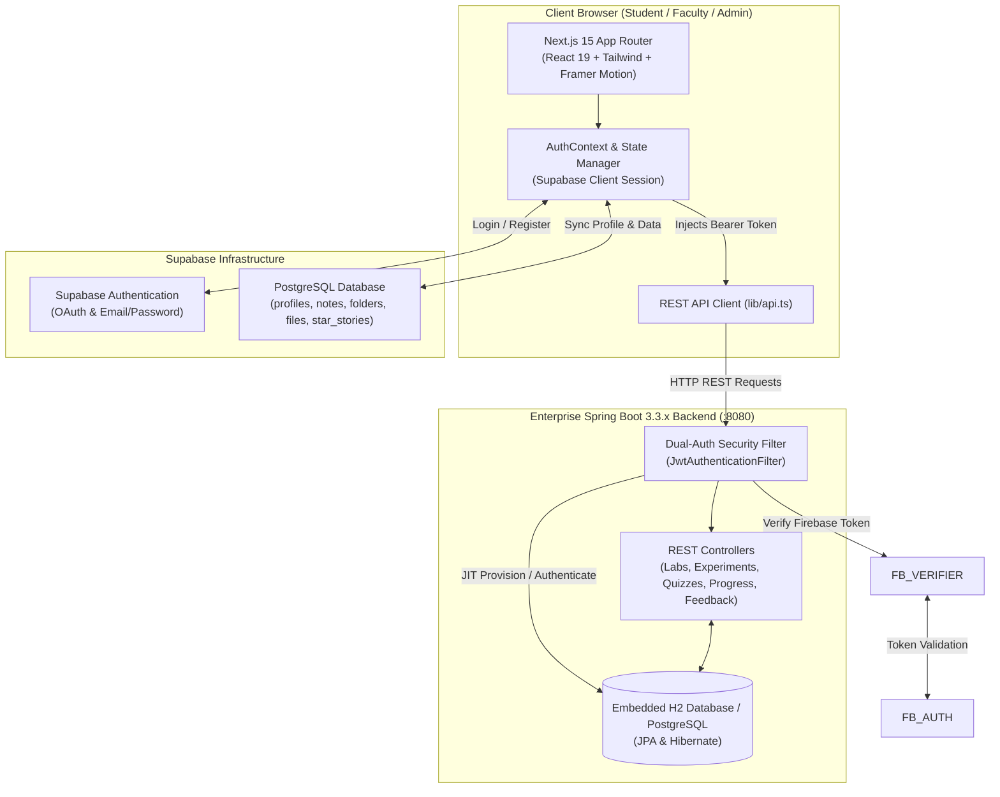
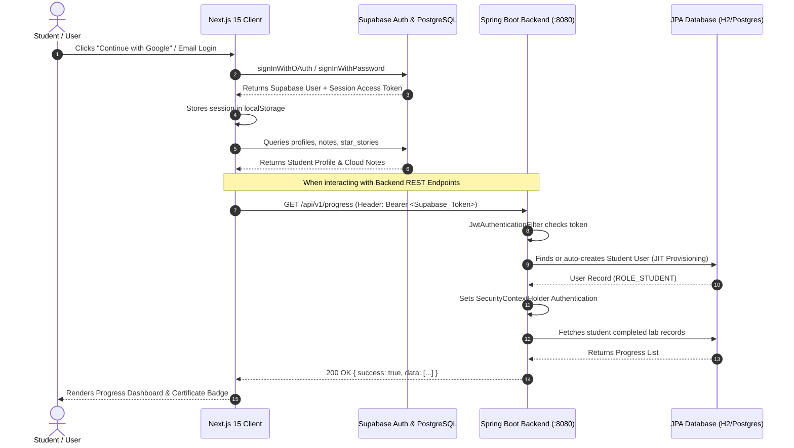

# 🏛️ Department Virtual Labs Platform & Learning Hub

[](https://nextjs.org/)
[](https://spring.io/projects/spring-boot)
[](https://openjdk.org/)
[](https://supabase.com/)
[](https://www.typescriptlang.org/)
[](https://tailwindcss.com/)

> **V.S.B. Engineering College** — **Department of Artificial Intelligence & Data Science (AI & DS)**  
> An enterprise-grade, simulation-based Virtual Laboratory Management System inspired by the National Virtual Labs initiative (`vlab.co.in`). Combining interactive algorithm simulators, JVM call-stack & recursion tree tracers, comprehensive laboratory syllabus alignment, real-time assessment quizzes, cloud file/notes management, and automated certificate generation.

---

## 📑 Table of Contents

- [System Architecture](#-system-architecture)
- [Key Features & Laboratory Modules](#-key-features--laboratory-modules)
- [Tech Stack Overview](#-tech-stack-overview)
- [Repository Structure](#-repository-structure)
- [Step-by-Step Setup Guide](#-step-by-step-setup-guide)
  - [Prerequisites](#prerequisites)
  - [1. Supabase & Environment Configuration](#1-supabase--environment-configuration)
  - [2. Frontend Setup (Next.js)](#2-frontend-setup-nextjs)
  - [3. Backend Setup (Spring Boot)](#3-backend-setup-spring-boot)
- [Authentication & Data Flow Diagram](#-authentication--data-flow-diagram)
- [REST API Reference](#-rest-api-reference)
- [Pre-Configured Test Credentials](#-pre-configured-test-credentials)
- [Institutional Alignment](#-institutional-alignment)

---

## 🏗️ System Architecture



---

## 🌟 Key Features & Laboratory Modules

### 1. Pure Java DSA 4-Part Experiment Workspace
Every laboratory experiment follows an exhaustive 4-part educational workflow:
- **Part 1: Video Tutorial & Theory Breakdown**: Embedded YouTube lecture videos, learning objectives, asymptotic time/space complexity matrices, and real-world industrial use cases.
- **Part 2: Interactive Java DSA Simulator**: Visual step-by-step state animator with speed controls (0.5x, 1.0x, 2.0x), timeline scrubber, comparison/swap counters, and sound feedback synthesizer.
- **Part 3: JVM Call Stack & Recursion Tree Trace**: Live LIFO frame push/pop animation with stack depth counters, SVG recursive call hierarchy trees, and line-by-line Java code transpiler.
- **Part 4: LeetCode Practice & Self-Assessment**: Curated coding challenges with difficulty tags (Easy, Medium, Hard), Java starter templates, and self-assessment quiz engine with instant score calculation and rationale explanations.

### 2. Four Core AI & DS Laboratories
1. **Data Structures & Algorithms Lab (DSL — AD8381)**: Arrays, Stacks, Queues, Linked Lists, Trees (BST, AVL), Heaps, Graphs (Dijkstra), Sorting & Searching.
2. **Machine Learning & Deep Learning Lab (MLDL — AD8481)**: Linear Regression, Logistic Regression, Decision Trees, Random Forests, SVM, K-Means Clustering, Neural Networks.
3. **Database Management Systems Lab (DBMS — AD8382)**: SQL DDL/DML, Relational Algebra, Normalization (1NF to BCNF), Joins, Subqueries, Transaction ACID properties.
4. **Computer Networks & Protocols Lab (CEN — AD8581)**: Socket Programming, TCP/UDP Client-Server, Subnetting, Routing Algorithms, Packet Sniffing.

### 3. ML Prerequisite Track
- **12 Interactive NumPy Master Modules**: Array creation, dimensional slicing, boolean masking, broadcasting, reshaping, linear algebra dot products, and random weight initialization.
- **Pandas Data Analysis**: Series, DataFrames, NaN imputation, and GroupBy operations.

### 4. Student Learning Dashboard & Certification
- Dynamic learner metrics: Completed labs counter, quiz accuracy %, certification status.
- Printable, high-fidelity **Lab Completion Certificate** with dynamic QR verification badge.
- **Academic Tabs**:
  - 📋 **Lab Assessments**: Attempt history, scores, and timestamped reviews.
  - 📁 **Lab Files & Manuals**: Cloud-synced folder organizer for lab observation manuals and datasets.
  - 📝 **Viva Notes**: Algorithm cheat sheets, derivations, and exam preparation notes.
  - 👥 **Batch Partners**: Collaborative lab partner assignments and faculty mentor mapping.

---

## 🛠️ Tech Stack Overview

### Frontend
- **Framework**: Next.js 15 (App Router, React 19)
- **Language**: TypeScript 5.x
- **Styling**: Tailwind CSS, Radix UI primitives, Lucide Icons
- **Animation & FX**: Framer Motion, Canvas Confetti
- **State Management**: React Context (`auth-context.tsx`) + Cloud Firestore + LocalStorage fallback
- **Visualizers**: Interactive SVG Canvas, JVM Call Stack animator, AST Code Runner

### Backend
- **Framework**: Spring Boot 3.3.2
- **Language**: Java 17 LTS / 21
- **Security**: Spring Security + JWT Authentication
- **ORM & Data**: Spring Data JPA, Hibernate, H2 In-Memory Database (Embedded) / PostgreSQL
- **Documentation**: SpringDoc OpenAPI 3 / Swagger UI (`/swagger-ui.html`)

### Database & Cloud Services
- **Supabase Authentication**: OAuth & Email/Password authentication
- **Supabase PostgreSQL**: Cloud database for student profiles, files, notes, STAR stories, and SRS tracking
- **Row-Level Security (RLS)**: Secure user data isolation

---

## 📂 Repository Structure

```
clg dept/
├── backend/                               # Spring Boot 3.3 Java Backend
│   ├── pom.xml                            # Maven dependencies (JPA, Security)
│   ├── README.md                          # Backend REST API documentation
│   └── src/main/
│       ├── java/com/college/virtuallab/
│       │   ├── VirtualLabApplication.java # Spring Boot entrypoint
│       │   ├── config/                    # SecurityConfig, JwtFilter
│       │   ├── auth/                      # Login/Register endpoints & AuthService
│       │   ├── user/                      # User entity, Role enum, UserRepository
│       │   ├── lab/                       # Lab entity, LabController, LabService
│       │   ├── experiment/                # Experiment entity & REST controller
│       │   ├── quiz/                      # Quizzes, questions, attempt submission
│       │   ├── progress/                  # Student progress tracking & ratings
│       │   ├── department/                # Engineering departments & courses
│       │   └── feedback/                  # Student reviews & ratings
│       └── resources/
│           └── application.yml            # Server port (8080), DB config, JWT properties
│
├── frontend/                              # Next.js 15 App Router Frontend
│   ├── app/                               # Route handlers & views
│   │   ├── page.tsx                       # Homepage (Hero, Objectives, Broad Areas, Announcements)
│   │   ├── labs/                          # Laboratory catalog & VLab sidebar pages
│   │   ├── experiments/[id]/              # 4-part experiment workspace
│   │   ├── visualizer/                    # Dedicated DSA visualization studio
│   │   ├── dashboard/                     # Student profile, certificate & tabs
│   │   └── auth/login/                    # Authentication page
│   ├── components/                        # Modular React components
│   │   ├── auth/                          # StudentAuthDialog modal
│   │   ├── dashboard/                     # ProgressCard, CertificateModal, Files, Notes, Team
│   │   ├── navigation/                    # Navbar (VSB logo, theme toggle, profile menu), Footer
│   │   ├── visualizer/                    # Dynamic animation controls & graph canvases
│   │   └── ui/                            # Shadcn UI primitives (dialog, tabs, badge, card)
│   ├── context/
│   │   └── auth-context.tsx               # Supabase Auth state & user synchronization
│   ├── lib/
│   │   ├── supabase.ts                    # Supabase client initialization & database helpers
│   │   ├── api.ts                         # Spring Boot REST API client
│   │   ├── storage.ts                     # Local progress persistence fallback
│   │   └── recursion-code-runner.ts       # JVM stack trace simulator
│   ├── public/                            # Static images, icons, and logos
│   ├── .env.local                         # Active environment variables
│   └── .env.local.example                 # Environment configuration template
│
├── package.json                           # Root scripts and workspace config
└── README.md                              # Main project documentation (this file)
```

---

## 🚀 Step-by-Step Setup Guide

### Prerequisites
Make sure you have the following installed on your machine:
- **Node.js**: `v18.x` or `v20.x` LTS ([Download](https://nodejs.org/))
- **Java JDK**: OpenJDK `17` or `21` LTS ([Download](https://adoptium.net/))
- **Apache Maven**: (Optional if using IDE runner) `3.8+` ([Download](https://maven.apache.org/))
- **Git**: ([Download](https://git-scm.com/))

---

### 1. Supabase & Environment Configuration

Create or verify the `.env.local` file inside the `frontend` folder:

```bash
# Location: frontend/.env.local

NEXT_PUBLIC_SUPABASE_URL=https://your-project.supabase.co
NEXT_PUBLIC_SUPABASE_ANON_KEY=eyJhbGciOiJIUzI1NiIsInR5cCI6IkpXVCJ9.your-anon-key

# Spring Boot REST API Base URL
NEXT_PUBLIC_API_URL=http://localhost:8080/api/v1
```

---

### 3. Frontend Setup (Next.js)

1. Open a terminal and navigate to the `frontend` directory:
   ```bash
   cd frontend
   ```

2. Install all dependencies:
   ```bash
   npm install
   ```

3. Launch the development server:
   ```bash
   npm run dev
   ```

4. Open [http://localhost:3000](http://localhost:3000) in your web browser.

---

### 4. Backend Setup (Spring Boot)

1. Navigate to the `backend` directory:
   ```bash
   cd backend
   ```

2. Run the application via Maven:
   ```bash
   mvn spring-boot:run
   ```
   *Or open `backend` in IntelliJ IDEA / VS Code / Eclipse and run `VirtualLabApplication.java`.*

3. The backend will initialize on port **8080** with context path `/api/v1`:
   - **Base URL**: `http://localhost:8080/api/v1`
   - **Interactive Swagger UI**: [http://localhost:8080/api/v1/swagger-ui.html](http://localhost:8080/api/v1/swagger-ui.html)
   - **Embedded H2 Console**: [http://localhost:8080/api/v1/h2-console](http://localhost:8080/api/v1/h2-console) (JDBC URL: `jdbc:h2:mem:virtuallabdb`, User: `sa`, Password: *blank*)

---

## 🔄 Authentication & Data Flow Diagram



---

## 📡 REST API Reference

| Method | Endpoint | Description | Access Level |
|---|---|---|---|
| `POST` | `/api/v1/auth/login` | Native email & password login, returns JWT | Public |
| `POST` | `/api/v1/auth/register` | Register new student or faculty account | Public |
| `GET` | `/api/v1/auth/me` | Fetch currently authenticated user profile | Authenticated (Supabase / JWT) |
| `GET` | `/api/v1/departments` | List all engineering departments | Public |
| `GET` | `/api/v1/courses` | List semester curriculum courses | Public |
| `GET` | `/api/v1/labs` | List all Virtual Laboratories | Public |
| `GET` | `/api/v1/labs/{slug}` | Get lab details and list of experiments | Public |
| `GET` | `/api/v1/experiments/{slug}` | Full experiment theory, procedure & simulator | Public |
| `GET` | `/api/v1/quizzes/experiment/{slug}` | Fetch quiz questions for an experiment | Public |
| `POST` | `/api/v1/quizzes/{quizId}/submit` | Submit answers, receive instant score & explanation | Authenticated |
| `GET` | `/api/v1/progress` | Student completed experiment history & badges | Authenticated |
| `POST` | `/api/v1/progress/experiments/{slug}` | Update experiment completion & star rating | Authenticated |
| `GET` | `/api/v1/announcements` | Department circulars, notices, and events | Public |
| `POST` | `/api/v1/feedback` | Submit student reviews and ratings | Public / Authenticated |

---

## 🔑 Pre-Configured Test Credentials

| Role | Email | Password | Permissions |
|---|---|---|---|
| **Department Admin** | `admin@vsb.ac.in` | `admin123` | Full lab management, circulars, curriculum editing |
| **Faculty Mentor** | `faculty@vsb.ac.in` | `faculty123` | Student review, score monitoring, viva feedback |
| **Student** | `student@vsb.ac.in` | `student123` | Experiment simulation, quizzes, certificates, notes |

*(Google Sign-In with any Google account is also supported and automatically provisions a student profile).*

---

## 🏛️ Institutional Alignment

- **Institution**: **V.S.B. Engineering College**, Karur, Tamil Nadu
- **Department**: **Department of Artificial Intelligence & Data Science (AI & DS)**
- **Curriculum Alignment**: Anna University / Autonomous Regulation Syllabi
- **Standards Reference**: National Virtual Labs Initiative, NMEICT, Ministry of Education, Govt. of India

---

## 📄 License

This project is developed for educational and academic laboratory instruction under the **AGPL-3.0 License**.
