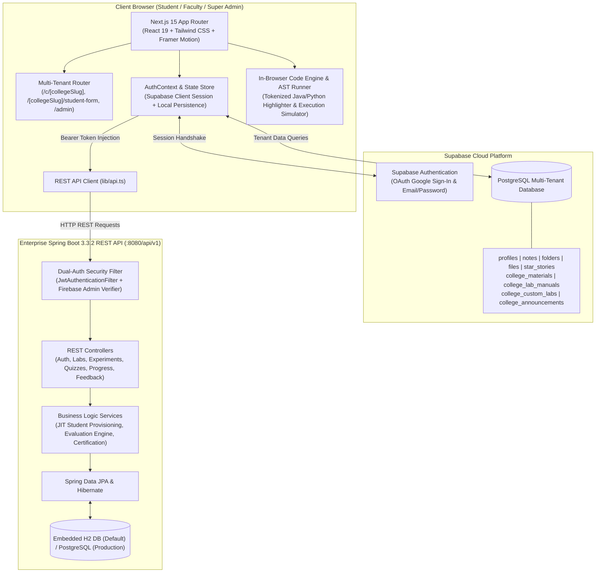
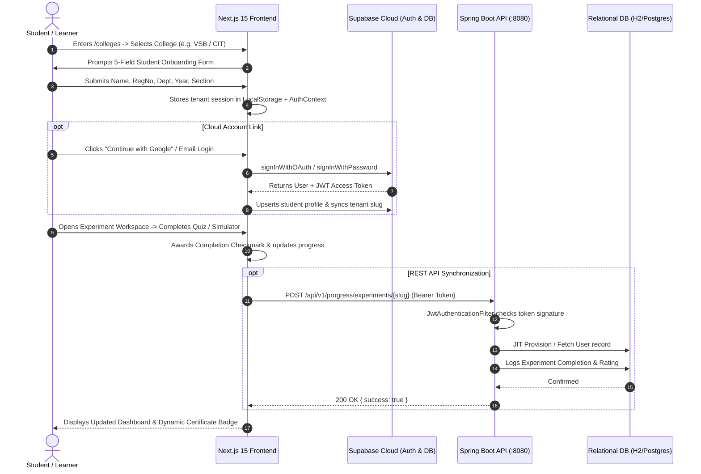

# 🏛️ Virtual Labs Platform — Multi-Tenant Campus Cloud & Learning Hub

[](https://nextjs.org/)
[](https://react.dev/)
[](https://spring.io/projects/spring-boot)
[](https://openjdk.org/)
[](https://supabase.com/)
[](https://www.typescriptlang.org/)
[](https://tailwindcss.com/)
[](https://www.gnu.org/licenses/agpl-3.0)

> **One Virtual Lab Platform. Customized for Every College.**  
> An enterprise-grade, multi-tenant simulation and continuous evaluation ecosystem inspired by the National Virtual Labs initiative (`vlab.co.in`). Engineered for engineering institutions, autonomous universities, and affiliated colleges to deliver interactive algorithm simulators, JVM call-stack tracers, curriculum-mapped laboratory manuals, real-time assessment quizzes, student progress telemetry, and automated certificate generation.

---

## 📑 Table of Contents

- [Overview & Value Proposition](#-overview--value-proposition)
- [System Architecture](#-system-architecture)
- [Multi-Tenant Campus Cloud](#-multi-tenant-campus-cloud)
- [12 Core Engineering Laboratories](#-12-core-engineering-laboratories)
- [4-Part Pedagogical Experiment Workspace](#-4-part-pedagogical-experiment-workspace)
- [Interactive Visualizer & Java Studio](#-interactive-visualizer--java-studio)
- [Admin & Faculty Command Center](#-admin--faculty-command-center)
- [Student Dashboard & Automated Certification](#-student-dashboard--automated-certification)
- [Academic Resources Repository](#-academic-resources-repository)
- [Tech Stack Breakdown](#-tech-stack-breakdown)
- [Repository Structure](#-repository-structure)
- [Step-by-Step Setup Guide](#-step-by-step-setup-guide)
  - [Prerequisites](#prerequisites)
  - [1. Environment Configuration](#1-environment-configuration)
  - [2. Frontend Setup (Next.js 15)](#2-frontend-setup-nextjs-15)
  - [3. Backend Setup (Spring Boot 3.3)](#3-backend-setup-spring-boot-33)
- [Authentication & Data Flow](#-authentication--data-flow)
- [REST API Reference & Swagger UI](#-rest-api-reference--swagger-ui)
- [Pre-Configured Credentials](#-pre-configured-credentials)
- [Institutional Alignment & Compliance](#-institutional-alignment--compliance)
- [Contributing & License](#-contributing--license)

---

## 💡 Overview & Value Proposition

Traditional engineering laboratories face severe challenges: limited hardware access, scheduling bottlenecks, disparate student preparation, and labor-intensive manual evaluation. The **Virtual Labs Platform** solves this by providing:

1. **True Multi-Tenancy**: Individual colleges (e.g., VSB, CIT, PSG Tech, SKCT, Anna University) operate on dedicated subpaths (`/c/[collegeSlug]`, `/[collegeSlug]/student-form`) with institutional branding, bespoke curricula, customized lab manuals, and isolated student cohorts.
2. **Zero-Installation Laboratory Simulations**: Students run complex Data Structures, Operating Systems, Computer Networks, Machine Learning, and Big Data simulations directly in modern web browsers with step-by-step state animations.
3. **Rigorous Academic Alignment**: Full mapping to Anna University, Autonomous CBCS, AICTE, NAAC, and NBA laboratory outcome matrices.
4. **Dual Authentication & Resilient Cloud Architecture**: Cloud authentication via Supabase and Firebase Admin SDK with Spring Security JWT tokens, plus instant offline LocalStorage fallback for zero-downtime laboratory execution.

---

## 🏗️ System Architecture



---

## 🌐 Multi-Tenant Campus Cloud

The platform supports a flexible multi-institution SaaS delivery model. Each institution gets a customized experience with isolated data, custom syllabi, and administrative oversight.

### Enrolled Institutions Registry

| College Slug | Institution Name | Code | Location | Accreditation & Status |
|---|---|---|---|---|
| `vsb` | **VSB Engineering College** | `9225` | Karur, Tamil Nadu | NAAC 'A', NBA, Autonomous CBCS |
| `cit` | **Coimbatore Institute of Technology** | `7176` | Coimbatore, Tamil Nadu | NAAC 'A+', NBA Tier-I, Govt. Aided |
| `psg` | **PSG College of Technology** | `7177` | Coimbatore, Tamil Nadu | NAAC 'A++', NBA, Autonomous |
| `skct` | **Sri Krishna College of Technology** | `7214` | Coimbatore, Tamil Nadu | NAAC 'A', NBA, Autonomous CBCS |
| `anna-univ` | **Anna University University Campus** | `0001` | Guindy, Chennai | NAAC 'A++', UGC Category-I |
| `demo` | **Apex Global Institute of Technology** | `9999` | Innovation Sandbox | AICTE Approved, Multi-Campus Cloud |

### Multi-Tenant Capabilities
- **Dedicated Institutional Portals (`/c/[collegeSlug]`)**: Custom header gradients, institutional emblems, accredited department listings, and college-specific observation sheets.
- **Student Onboarding (`/[collegeSlug]/student-form`)**: Frictionless 5-field registration (Name, Register Number, Year, Department, Section) with instant session provisioning.
- **Tenant Data Isolation (`lib/supabase-multitenant.ts`)**: Scoped retrieval of study materials, lab manuals, custom lab sandbox URLs, bilingual lecture links, and campus circulars.
- **Institutional SaaS Monetization (`/components/landing/saas-pricing-section.tsx`)**:
  - **Department Starter**: ₹24,999/year (Up to 500 students, single department)
  - **Enterprise Campus**: ₹89,999/year (All engineering branches, NAAC/NBA audit reporting)
  - **Autonomous University**: Custom SLA (Multi-campus management, on-premise/hybrid cloud)

---

## 🔬 12 Core Engineering Laboratories

The platform houses 12 full-semester engineering laboratories covering fundamental, intermediate, and advanced computing disciplines:

```
┌─────────────────────────────────────────────────────────────────────────────┐
│                       12 VIRTUAL LABORATORIES CATALOGUE                     │
├───────────────────────────────┬─────────────────────────────┬───────────────┤
│ Laboratory Name               │ Course Code & Semester      │ Primary Focus │
├───────────────────────────────┼─────────────────────────────┼───────────────┤
│ 1. Data Structures & Algos    │ AD8381 (Semester 3)         │ Java / DSA    │
│ 2. Object Oriented Java       │ CS3351 (Semester 3)         │ Java OOP      │
│ 3. Database Management (DBMS) │ AD8382 (Semester 3)         │ SQL / PL-SQL  │
│ 4. C Programming Laboratory   │ CS3151 (Semester 1)         │ C / Systems   │
│ 5. Python Programming Lab     │ GE3171 (Semester 1)         │ Python / OOP  │
│ 6. Data Science & Analytics   │ AD8482 (Semester 4)         │ NumPy / Stats │
│ 7. Computer Networks Lab      │ AD8581 (Semester 4)         │ Sockets / TCP │
│ 8. Machine Learning Lab       │ AD8481 (Semester 4)         │ Scikit / ANN  │
│ 9. Operating Systems Lab      │ CS3461 (Semester 4)         │ POSIX / CPU   │
│ 10. Artificial Intelligence   │ AI3401 (Semester 5)         │ A* / Heuristics│
│ 11. Big Data Analytics Lab    │ CS8711 (Semester 5)         │ Spark / HDFS  │
│ 12. Cloud Service Management  │ CS8811 (Semester 5)         │ AWS / Docker  │
└───────────────────────────────┴─────────────────────────────┴───────────────┘
```

---

## 🎯 4-Part Pedagogical Experiment Workspace

Every experiment adheres to an exhaustive 4-part instructional design model:

```
Part 1: Video & Theory ──> Part 2: Interactive Simulator ──> Part 3: JVM Stack Trace ──> Part 4: LeetCode & Quiz
```

1. **Part 1: Video Tutorial & Theory Breakdown**:
   - Curated high-definition lecture videos in both **English** and **Tamil** (e.g., 18+ hour masterclasses, Neso Academy, Gate Smashers, Kunal Kushwaha).
   - Bloom's taxonomy objectives, prerequisite trees, and real-world industrial case studies.
   - Comprehensive **Asymptotic Time & Space Complexity Matrices** (Best, Average, Worst case notations).
2. **Part 2: Interactive Algorithm Simulator**:
   - Visual step-by-step array, node, or matrix state animations.
   - Interactive playback controls: Play, Pause, Step-Forward, Step-Backward, Reset.
   - Speed throttling (0.5x, 1.0x, 2.0x), comparison/swap counter metrics, and Web Audio API synthesized sound feedback.
3. **Part 3: JVM Call Stack & Recursion Tree Tracer**:
   - Real-time LIFO activation record push/pop frame animations.
   - Visual call depth counters and SVG recursion trees.
   - Line-by-line highlight synchronizer matching code execution with visual state changes.
4. **Part 4: LeetCode Challenges & Self-Assessment Quizzes**:
   - Curated LeetCode problems categorized by difficulty (`Easy`, `Medium`, `Hard`) with starter templates and solution approaches.
   - Built-in **QuizEngine** featuring timer countdowns, randomized questions, passing thresholds, instant score calculation, and detailed answer rationales.

---

## 💻 Interactive Visualizer & Java Studio

Located at `/dsa-visualization` and `/visualizer`:

- **Dedicated Java Code Studio (`java-code-viewer.tsx`)**:
  - VS Code Dark+ syntax tokenizer with keyword, type, comment, and string highlighting.
  - In-browser execution engine simulating standard Java outputs without requiring a remote compiler.
  - **"Send to Visualizer"** button: Automatically extracts array literals from Java code and passes them straight to the animation canvas.
- **Algorithm Coverage**:
  - Sorting: Bubble Sort, Selection Sort, Insertion Sort, Merge Sort, Quick Sort, Heap Sort, Radix Sort.
  - Searching: Linear Search, Binary Search, Exponential Search.
  - Linear Data Structures: Singly Linked List, Doubly Linked List, Circular Linked List, Array/Dynamic Stack, Circular Queue.
  - Trees & Graphs: Binary Search Tree (BST), AVL Tree (Self-Balancing Rotations), Trie Prefix Tree, Dijkstra's Shortest Path, Prim's/Kruskal's MST.
- **Coding Sheets View**:
  - Striver's SDE Sheet, Love Babbar 450, and NeetCode 150 integration with topic filtering and persistent progress tracking.

---

## 🛡️ Admin & Faculty Command Center

Accessible at `/admin` for authorized departmental faculty and super administrators:

- **Multi-Tenant Institution Switcher**: Seamlessly toggle between VSB, CIT, PSG Tech, SKCT, Anna University, or Apex Demo.
- **Student Cohort Management**:
  - Search by Name, Register Number, or Section.
  - Filter by Academic Year (`I Year` – `IV Year`), Department, and Class.
  - Detailed student inspection modal: Review completed experiments, starred problems, and quiz score breakdown.
  - **One-Click CSV / Spreadsheet Export** for NAAC/NBA audit documentation and Continuous Internal Evaluation (CIE).
- **Tenant Content Management (CRUD)**:
  - **Study Materials**: Upload lecture notes, question banks, and reference books (PDF, DOC, Web links).
  - **Lab Manuals**: Manage official college lab manuals and observation sheets.
  - **Custom Labs**: Register external interactive tools, Google Colab notebooks, and virtual sandbox environments.
  - **Bilingual Video Tutorials**: Link YouTube courses with language tagging (Tamil, English, Bilingual).
  - **Campus Announcements**: Publish urgent notifications, model exam schedules, and circulars with priority tags (`High`, `Normal`, `Urgent`).

---

## 🎓 Student Dashboard & Automated Certification

Located at `/dashboard`:

- **Real-Time Telemetry**: Tracks completed experiments, solved problems, quiz accuracy rates, and stars.
- **Cryptographically Verifiable Lab Completion Certificate**:
  - Generates a high-fidelity printable certificate once a student completes the required lab quota.
  - Features dynamic student registration details, department accreditation, completion date, and an embedded **QR Verification Badge**.
- **Student Workspaces**:
  - 📋 **Lab Assessments**: Historical review of quiz attempts and scores.
  - 📁 **Lab Files & Manuals**: Cloud-synced personal folder organizer for observation notes and laboratory write-ups.
  - 📝 **Viva Notes**: Algorithm cheat sheets, derivations, and viva-voce prep.
  - 👥 **Batch Partners**: Collaborative lab partner mapping and assigned faculty mentor contact.

---

## 📚 Academic Resources Repository

Located at `/resources`:

- **Universal Search & Filtering**: Filter by subject (DSA, Java OOP, DBMS, Networks, OS, Python, Data Science, AI, Big Data, Cloud) or material type (`Lab Material` vs. `Lab Manual`).
- **Curated Providers**: Direct verified references to GeeksforGeeks, W3Schools, Official Docs, and Department Virtual Lab Manuals.
- **Download Metrics**: Community download counters and topic tags for quick discovery.

---

## 🛠️ Tech Stack Breakdown

### Frontend (Modern Web)
| Layer | Technologies |
|---|---|
| **Framework** | Next.js 15.5 (App Router, Server & Client Components) |
| **Runtime & UI** | React 19, TypeScript 5, Tailwind CSS 3.4, PostCSS |
| **Component Primitives** | Radix UI (Dialog, Tabs, Select, Dropdown, Tooltip, Avatar, Toast) |
| **Animation & Canvas** | Framer Motion 11, Canvas Confetti, Custom SVG Visualizer |
| **State & Auth** | React Context (`auth-context.tsx`), `@supabase/ssr`, `@supabase/supabase-js` |
| **Icons & Typography** | Lucide React, Geist Sans, Fontshare Cabin / Clash Grotesk |

### Backend (Enterprise Java)
| Layer | Technologies |
|---|---|
| **Framework** | Spring Boot 3.3.2 |
| **Language** | Java 17 LTS / Java 21 |
| **Security** | Spring Security 6, JJWT 0.12.5, Firebase Admin SDK 9.3.0 |
| **Persistence & ORM** | Spring Data JPA, Hibernate, PostgreSQL Driver |
| **Databases** | Embedded H2 (Zero-setup development), PostgreSQL (Production) |
| **API Documentation** | SpringDoc OpenAPI 2.5.0 / Swagger UI 3 |

### Database & Cloud Services
| Service | Purpose |
|---|---|
| **Supabase Auth** | Google OAuth & Secure Email/Password sessions |
| **Supabase PostgreSQL** | Cloud storage for profiles, notes, files, star stories, tenant data |
| **Firebase Admin** | Enterprise token validation and JIT student provisioning |
| **LocalStorage Engine** | Seamless client-side cache and offline demonstration fallback |

---

## 📂 Repository Structure

```
clg dept/
├── package.json                           # Root workspace scripts (dev, build, start, lint)
├── .env.example                           # Master environment variables template
├── README.md                              # Main platform documentation
│
├── frontend/                              # Next.js 15 App Router Frontend
│   ├── app/
│   │   ├── page.tsx                       # Global landing & gateway page
│   │   ├── colleges/                      # Institutional directory & selection portal
│   │   ├── [collegeSlug]/                 # Dynamic college routes
│   │   │   ├── page.tsx                   # Redirects to student onboarding
│   │   │   ├── student-form/              # 5-field student onboarding form
│   │   │   └── lab/                       # Direct laboratory router
│   │   ├── c/[collegeSlug]/               # Dedicated branded college portal page
│   │   ├── labs/                          # 12-lab catalogue & lab overview
│   │   │   └── [labId]/                   # Individual lab dashboard & experiment listing
│   │   ├── experiments/[id]/              # 4-Part interactive experiment workspace
│   │   ├── dsa-visualization/             # Master DSA visualizer & coding sheets
│   │   ├── visualizer/                    # Dedicated algorithm sandbox
│   │   ├── resources/                     # Curated academic notes & manuals repository
│   │   ├── dashboard/                     # Student profile, certificate & tabs
│   │   ├── admin/                         # Multi-tenant faculty & admin control panel
│   │   ├── auth/login/                    # Unified authentication portal
│   │   ├── courses/                       # Semester curriculum & syllabus
│   │   ├── globals.css                    # Design system tokens & CSS variables
│   │   └── layout.tsx                     # Root layout with ThemeProvider & AuthProvider
│   │
│   ├── components/
│   │   ├── auth/                          # StudentAuthDialog & StudentOnboardingModal
│   │   ├── dashboard/                     # ProgressCard, CertificateModal, Files, Notes, Team
│   │   ├── landing/                       # CollegeSelectorHero, SaasPricingSection
│   │   ├── navigation/                    # Responsive Navbar, Global Search, Footer
│   │   ├── quiz/                          # QuizEngine, timers, score evaluation
│   │   ├── visualizer/                    # JavaCodeViewer, SortingVisualizer, TreeCanvases
│   │   ├── vlab/                          # BroadAreasGrid, HeroObjectives, Announcements
│   │   └── ui/                            # Shadcn / Radix UI component primitives
│   │
│   ├── context/
│   │   └── auth-context.tsx               # Unified auth state, Supabase & local persistence
│   ├── data/
│   │   ├── colleges.ts                    # Multi-tenant college registry & metadata
│   │   ├── labs.ts                        # 12 laboratories specification & playlists
│   │   ├── experiments.ts                 # Master experiment registry
│   │   ├── experiments-data/              # Theory, code, complexities for all 12 labs
│   │   ├── quizzes.ts                     # Self-assessment quiz banks & rationales
│   │   ├── resources.ts                   # Curated GFG/W3Schools/Manual links
│   │   └── dsa-sections.ts                # Striver / Love Babbar DSA syllabus mapping
│   ├── lib/
│   │   ├── supabase.ts                    # Supabase client & core data methods
│   │   ├── supabase-multitenant.ts        # Tenant-scoped data access layer
│   │   ├── api.ts                         # Spring Boot backend REST client
│   │   └── utils.ts                       # UI styling & helper utilities
│   └── package.json                       # Frontend dependencies & Next.js scripts
│
└── backend/                               # Spring Boot 3.3 Java Backend
    ├── pom.xml                            # Maven dependencies (Security, JPA, Swagger)
    ├── README.md                          # Dedicated backend README
    └── src/main/
        ├── java/com/college/virtuallab/
        │   ├── VirtualLabApplication.java # Spring Boot main entrypoint
        │   ├── config/                    # SecurityConfig, JwtAuthenticationFilter, WebMvcConfig
        │   ├── auth/                      # Login/Register endpoints, AuthService, JwtTokenProvider
        │   ├── user/                      # User entity, Role enum, UserRepository
        │   ├── lab/                       # Lab entity, LabController, LabService
        │   ├── experiment/                # Experiment entity & REST controller
        │   ├── quiz/                      # Quiz, questions, attempt submission controller
        │   ├── progress/                  # Student progress tracking & ratings service
        │   ├── department/                # Department & course curriculum controllers
        │   └── feedback/                  # Student review & ratings controller
        └── resources/
            └── application.yml            # Server port (8080), JPA, H2/PostgreSQL config
```

---

## 🚀 Step-by-Step Setup Guide

### Prerequisites
Before running the application locally, ensure you have installed:
- **Node.js**: `v18.x` or `v20.x+` LTS ([Download Node.js](https://nodejs.org/))
- **Java JDK**: OpenJDK `17` or `21` LTS ([Download Adoptium Temurin](https://adoptium.net/))
- **Apache Maven**: `3.8+` (Optional if running via your IDE) ([Download Maven](https://maven.apache.org/))
- **Git**: ([Download Git](https://git-scm.com/))

---

### 1. Environment Configuration

1. In the repository root, inspect `.env.example`.
2. Navigate to the `frontend` folder and create a `.env.local` file:

```bash
# Location: frontend/.env.local

# Supabase Authentication & PostgreSQL Cloud
NEXT_PUBLIC_SUPABASE_URL=https://fxozrkxpnnpvnzqguugk.supabase.co
NEXT_PUBLIC_SUPABASE_PUBLISHABLE_KEY=sb_publishable_bLMZgS-WWCJjzmB6IaAWUQ_NFqlSbkX
NEXT_PUBLIC_SUPABASE_ANON_KEY=sb_publishable_bLMZgS-WWCJjzmB6IaAWUQ_NFqlSbkX

# Spring Boot REST API Endpoint
NEXT_PUBLIC_API_URL=http://localhost:8080/api/v1
```

*(Note: The platform is pre-configured with secure fallback credentials so that it runs immediately out-of-the-box.)*

---

### 2. Frontend Setup (Next.js 15)

1. Open your terminal and navigate to the `frontend` directory:
   ```bash
   cd frontend
   ```
2. Install all dependencies:
   ```bash
   npm install
   ```
3. Start the Next.js development server:
   ```bash
   npm run dev
   ```
4. Access the web interface at **[http://localhost:3000](http://localhost:3000)**.

> **Tip**: You can also launch the frontend from the root directory by running:
> ```bash
> npm run dev
> ```

---

### 3. Backend Setup (Spring Boot 3.3)

1. Open a new terminal and navigate to the `backend` directory:
   ```bash
   cd backend
   ```
2. Run the application using the Maven wrapper or installed Maven:
   ```bash
   mvn spring-boot:run
   ```
   *Alternatively, open `backend/pom.xml` in IntelliJ IDEA, Eclipse, or Antigravity IDE and run `VirtualLabApplication.java`.*

3. The backend will start on **port 8080** under the `/api/v1` context path:
   - **Base API URL**: `http://localhost:8080/api/v1`
   - **Interactive Swagger UI**: [http://localhost:8080/api/v1/swagger-ui.html](http://localhost:8080/api/v1/swagger-ui.html)
   - **Embedded H2 Console**: [http://localhost:8080/api/v1/h2-console](http://localhost:8080/api/v1/h2-console)  
     *(JDBC URL: `jdbc:h2:mem:virtuallabdb`, Username: `sa`, Password: `[blank]`)*

---

## 🔄 Authentication & Data Flow



---

## 📡 REST API Reference & Swagger UI

The Spring Boot backend exposes a comprehensive set of RESTful endpoints. When the backend is running, browse the full interactive documentation at `http://localhost:8080/api/v1/swagger-ui.html`.

| Method | Endpoint | Description | Access Level |
|---|---|---|---|
| `POST` | `/api/v1/auth/login` | Email & password authentication; returns JWT | Public |
| `POST` | `/api/v1/auth/register` | Register new student or faculty account | Public |
| `GET` | `/api/v1/auth/me` | Fetch profile for currently authenticated user | Authenticated (JWT / Supabase) |
| `GET` | `/api/v1/departments` | List all engineering departments | Public |
| `GET` | `/api/v1/courses` | List syllabus curriculum courses (Sem 1–8) | Public |
| `GET` | `/api/v1/labs` | List all 12 Virtual Engineering Laboratories | Public |
| `GET` | `/api/v1/labs/{slug}` | Fetch laboratory details and list of experiments | Public |
| `GET` | `/api/v1/experiments/{slug}` | Full experiment theory, simulator & procedure | Public |
| `GET` | `/api/v1/quizzes/experiment/{slug}` | Fetch self-assessment quiz questions | Public |
| `POST` | `/api/v1/quizzes/{quizId}/submit` | Submit answers; returns score & rationales | Authenticated |
| `GET` | `/api/v1/progress` | Get student completed experiments & badges | Authenticated |
| `POST` | `/api/v1/progress/experiments/{slug}` | Mark experiment completed & log rating | Authenticated |
| `GET` | `/api/v1/announcements` | Circulars, exam notifications, and events | Public |
| `POST` | `/api/v1/feedback` | Submit student reviews and ratings | Public / Authenticated |

---

## 🔑 Pre-Configured Credentials

For evaluation, continuous testing, and demonstrations, the following accounts are pre-seeded in the database:

### Standard Application Roles
| Role | Email | Password | Scope & Capabilities |
|---|---|---|---|
| **Department Admin** | `admin@vsb.ac.in` | `admin123` | Full lab management, circulars, syllabus editing |
| **Faculty Mentor** | `faculty@vsb.ac.in` | `faculty123` | Student review, score monitoring, viva feedback |
| **Student** | `student@vsb.ac.in` | `student123` | Experiment simulations, quizzes, certificates, notes |

### Multi-Tenant Super Admin Console (`/admin`)
| Console | Admin Email | Password | Capabilities |
|---|---|---|---|
| **Tenant Admin Portal** | `anishanth404@gmail.com` | `bjp93admk63` | Multi-college switcher, student roster export, material/manual CRUD |

*(Google OAuth Sign-In with any Google account is also supported and automatically provisions a student profile on the fly).*

---

## 🏛️ Institutional Alignment & Compliance

- **Lead Institution**: **V.S.B. Engineering College**, Karur, Tamil Nadu (Autonomous, NAAC 'A', NBA)
- **Host Department**: **Department of Artificial Intelligence & Data Science (AI & DS)**
- **Partner & Supported Institutions**: CIT Coimbatore, PSG Tech, SKCT, Anna University
- **Curriculum Alignment**: Anna University Regulations 2021 & Autonomous CBCS 2022/2023 Syllabi
- **National Benchmark**: Aligned with the pedagogical objectives of the **National Mission on Education through ICT (NMEICT)**, Ministry of Education, Government of India (`vlab.co.in`).
- **Accreditation Readiness**: Generates auditable student engagement logs and continuous evaluation matrices for **NAAC Criterion 1 & 2** and **NBA Criteria 2, 4 & 5**.

---

## 🤝 Contributing & License

Contributions are warmly welcomed! To contribute:

1. Fork the repository.
2. Create your feature branch (`git checkout -b feature/amazing-feature`).
3. Commit your changes (`git commit -m 'Add amazing feature'`).
4. Push to the branch (`git push origin feature/amazing-feature`).
5. Open a Pull Request.

This project is licensed under the **GNU Affero General Public License v3.0 (AGPL-3.0)** — see the LICENSE file for details.

---

<div align="center">
  <sub>Developed with ❤️ for engineering students, faculty, and academic researchers.</sub>
</div>
